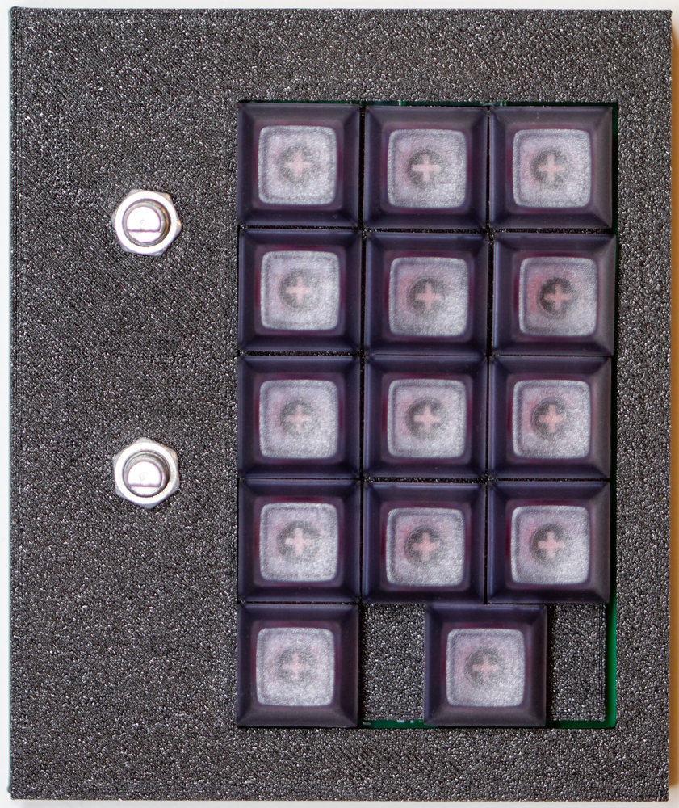

# MacroPaw KnGXT Assembly Guide

|  |  |
| :-: | :-: |
| _Assembled KnGXT_     | _KnGXT PCB_ |

The MacroPaw KnGXT was produced as a partly-assembled two-sided PCB board: all
the surface-mount components were installed at the factory, but quite a bit
was still left to be done:

- Factory reset (optional with a new board)
- Install firmware
- Basic hardware test
- Install hotswap sockets
- Install rotary encoders
- Install switches
- Full hardware test
- Install into case

## Factory Reset

To completely reset a KnGXT to new-out-of-the-factory condition, you need to
wipe its onboard flash memory. **WARNING: this will, of course, erase any
customization you've done.**

1. Grab David Welch's `flash_nuke.uf2` from
   https://github.com/dwelch67/raspberrypi-pico. This is a minimal RP2040
   program to completely wipe the attached flash.

   ```bash
   curl -o /tmp/flash_nuke.uf2 https://github.com/dwelch67/raspberrypi-pico/raw/main/flash_nuke.uf2
   ```

2. Hold down the USB_BOOT button on the MacroPaw KnGXT board and plug it into
   your computer with a USB-C cable.

    

3. The KnGXT should appear as a USB Mass Storage device named `RPI_RP2` on
   your computer.

4. Copy `flash_nuke.uf2` to the `RPI_RP2` volume. Note that with MacOS Ventura and
   later, the Finder won't work for this: use `cp` from a shell window instead.

   ```bash
   cp /tmp/flash_nuke.uf2 /Volumes/RPI_RP2
   ```

5. The `RPI_RP2` volume will vanish while `flash_nuke` runs, then return once it's done.

## Install Firmware

1. Grab the most recent MacroPaw KnGXT firmware from www.kodachi.com:

   ```bash
   curl -o /tmp/macropaw-KnGXT.uf2 https://www.kodachi.com/firmware/macropaw-KnGXT.uf2
   ```

   (Alternately, you can build your own firmware: follow the docs in [BUILDING.md].)

2. If your KnGXT doesn't already show up as the `RPI_RP2` volume, hold down
   the USB_BOOT button on the MacroPaw KnGXT board and plug it into your
   computer with a USB-C cable. The KnGXT should appear as a USB Mass Storage
   device named `RPI_RP2` on your computer.

    

3. Copy the firmware to the `RPI_RP2` volume. Note that with MacOS Ventura and
   later, the Finder won't work for this: use `cp` from a shell window instead.

   ```bash
   cp /tmp/macropaw-KnGXT.uf2 /Volumes/RPI_RP2
   ```

   **This step can take awhile.** 30-60 seconds is not unusual.

4. Wait for the KnGXT to reboot into hardware test mode. If this is a bare
   board, proceed to "Basic Hardware Test" below; if fully assembled, continue
   to "Full Hardware Test".

## Basic Hardware Test

The first time a MacroPaw is booted after new firmware is installed, it will
launch in _hardware test mode_. This mode doesn't function as a keyboard:
instead, it lets you verify that the LEDs, keyswitches, and rotary encoders on
the board work.

When booting in hardware test mode, all the lights will flash yellow at
startup. The LEDs should then cycle through red, green, and blue, then end up
all at a dim white.

When testing a board with no switches or encoders, this is as far as you can
reasonably go. Unplug the MacroPaw to continue to installing the hotswap sockets.

## Install Hotswap Sockets

Flip the board over to solder all 14 hotswap sockets on from the back of the
board. They'll only fit in one orientation, and they're fairly straightforward
to solder.


## Install Rotary Encoders

The KnGXT takes two EC11 rotary encoders where the shaft contains a
pushbutton. Insert these from the front of the board and solder them from the
back. Make certain to keep them straight when soldering! If you let them slant
much, you won't be able to get the case on.


## Install Switches

The easiest way to install the switches into a KnGXT is actually to start by
plugging all the switches into the switch plate (since the plate doesn't have
standoffs, it's just there to support the keyswitches laterally):

| |  |  |
| :-: | :-: | :--: |
| _Empty switch plate_ | _Partially populated_ | _Fully populated_ |

**The orientation of the keyswitches is important.** Make sure that the pins are at the top, not rotated.


Once the switches are in the plate, **carefully** insert the switch pins into
the hotswap sockets, then press firmly to fully seat everything. Finish by
setting the board into the bottom of its case, LEDs up, rotary encoders on the
  left.


|  |
| :-: |
| _Make very sure the pins line up with the hotswap holes..._ |

|  |
| :-: |
| _...before fully seating the keys into the board and laying in on the case bottom._ |

## Full Hardware Test

Once you have rotary encoders and switches installed, you can do the full
hardware test. Plug the MacroPaw back in; it should reboot to hardware test
mode again.

Once all the LEDs are dim white:

- Turning a rotary encoder counterclockwise should cause its ring of LEDs to
  turn red.

- Turning a rotary encoder clockwise should cause its ring of LEDs to turn
  green.

- Pressing a rotary encoder should cause its ring of LEDs to turn blue.
  Pressing it again should turn its LEDs off.

- Pressing a key should change its LED to red. Repeated presses should turn it
  green, then blue, then off.

- When you've cycled all the LEDs have gone through all their colors, you
  should see all the LEDs turn green again. Unplug the MacroPaw and plug it
  back in to exit hardware test.

## Install into Case

Installing the KnGXT into its case is fairly straightforward.

- Make sure the rotary encoders have neither their knobs nor locking nuts on
  their shafts.

- With the MacroPaw already in the bottom half of the case (LEDs up, rotary
  encoders on the left), lay the top half of the case over the MacroPaw (it
  will go neatly over the key switches).

  

- Screw the rotary encoder locking nuts on, just finger-tight: overdoing it
  could bend the case, or cause the case to always be pressing the BOOT
  button.

  

- Put the rotary encoder knobs on.

  

- Screw the board halves together with four 1/2-inch #4 screws.

  

- Plug the board back in!

## Using Your MacroPaw

After leaving hardware test mode, your MacroPaw should be a real keyboard. It
should flash all its lights yellow when first booting, then start a blue
"breathing" animation with the LEDs under the keys repeatedly cycling across
brightnesses. Check out the [User Guide] for more on using your MacroPaw.

[BUILDING.md]: BUILDING.md
[User Guide]: USERGUIDE.md
