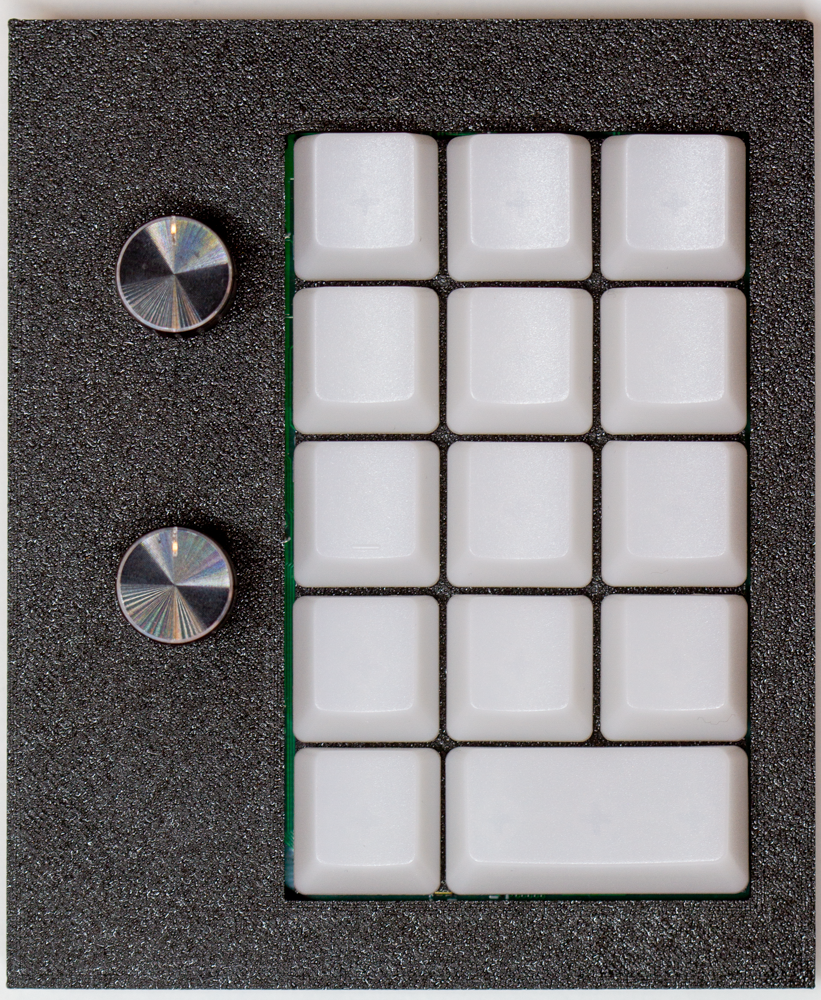
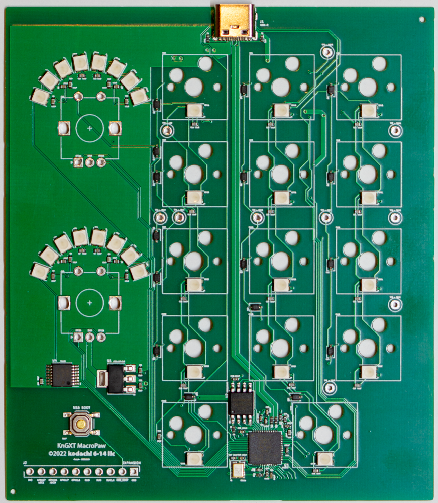

The MacroPaw keypads are a line of small yet fully-customizable mechanical
keyboards. (The name was originally from my son, years ago when he was young,
and the "paw" motif has kinda stuck.) Every MacroPaw has MX-style switches
with RGB LEDs under the keys, USB-C connectivity, and absurd customizability.

|  |  |
| :-: | :-: |
| _Assembled KnGXT_     | _KnGXT PCB_ |

KnGXT: Mostly a proof-of-concept for an RP2040-based USB HID: it has 14
       hotswappable MX keyswitches in a 3x5 layout like a number pad
       (including one 2U key, which is why it's 14 instead of 15), two rotary
       encoders with pushbuttons, and a bunch of RGB LEDs.

KnGYT: Mostly a proof-of-concept for double-sided assembly. It has ten
       hotswappable MX keyswitches in a 5x2 grid, ten RGB LEDs, and no rotary
       encoders. It's _much_ smaller than its sibling the KnGXT, because most
       of the electronics are on the back of the board.

Both the firmware and the hardware of the MacroPaws are **open source**.

## Firmware

The firmware is licensed under the GNU General Public License, version 3.0 or
later.

The `firmware` directory within each board's directory includes the firmware
source code firmware and the firmware license (in `firmware/LICENSE`).

The MacroPaw firmware is based on the [KMK Firmware], and on Adafruit's
[CircuitPython] and the [NeoPixelBackground] class.

- You can find the CircuitPython fork with the MacroPaw board definitions at
  [http://github.com/kodachi614/circuitpython] in the `main` branch. In
  addition to the board definitions, this branch allows setting whether rotary
  encoders need a pullup or a pulldown (at least for the RP2040); this change
  is necessary for the KnGXT because its encoders are mounted the way
  CircuitPython doesn't expect.

- You can find the KMK fork the MacroPaws use at
 [http://github.com/kodachi614/kmk_firmware] in the `main` branch. See its
 README for changes here; there are several.

To build your own copy of the firmware, just clone this repo and run `make` on
a Mac or Linux box (you will need to `brew install dosfstools` on your Mac,
and then make sure that `/opt/homebrew/sbin` is in your `PATH`, for this to
work).

Alternately, you can grab prebuilt firmware for the [MacroPaw KnGXT] and the [MacroPaw KnGYT].

[KMK Firmware]: https://github.com/KMKfw/kmk_firmware/
[CircuitPython]: https://circuitpython.org/
[NeoPixelBackground]: https://learn.adafruit.com/intro-to-rp2040-pio-with-circuitpython/advanced-using-pio-to-drive-neopixels-in-the-background
[MacroPaw KnGXT]: https://www.kodachi.com/firmware/macropaw-KnGXT.uf2
[MacroPaw KnGXC]: https://www.kodachi.com/firmware/macropaw-KnGYT.uf2

## Hardware

The hardware is licensed under the CERN Open Hardware License, version 2.0
or higher, Strongly Reciprocal.

The `hardware` directory within each board's directory includes the [KiCad] 7
design files for the hardware, the fabrication outputs used for the official
production runs of the hardware, and of course the hardware license (in
`hardware/LICENSE`).

[KiCad]: https://www.kicad.org/

## 3D Models

The `models` directory within some boards' directories includes the 3D models
for cases, etc., for the board. Boards without a `models` directory haven't
had models made yet!

The models are also licensed under the CERN Open Hardware License, version 2.0
or higher, Strongly Reciprocal.