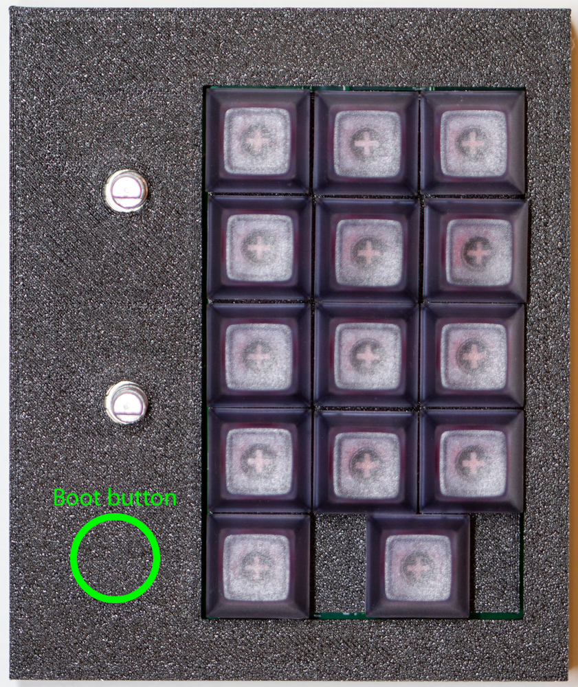

# MacroPaw User Guide

The MacroPaw keypads are a line of small yet fully-customizable mechanical
keyboards. (The name was originally from my son, years ago when he was young,
and the "paw" motif has kinda stuck.) The core of the MacroPaws is a Raspberry
Pi RP2040 with 16MiB of flash memory, a USB-C connector, and an attached key
matrix and RGB LEDs (which may or may not be under the keys). Some MacroPaws
have more capability than others; all are crazy customizable by writing Python
code. (Yes. Python. On a keyboard. It's insane and wonderful to live in the
future.)

This guide covers the MacroPaw KnGXT and KnGYT boards. There is a [separate
guide] for the MacroPaw Beatboxer KnH0F board.

[separate guide]: USERGUIDE-BEATBOXER.md

## Overview

| Name  | Keys | Layout | Rotary Encoders |
| :---- | :--: | :----: | :-------------- |
| KnGXT |  14  | 3x5    | 2               |
| KnGYT |  10  | 5x2    | 0               |

The default firmware (available at https://www.kodachi.com/firmware) supports
multiple layers for a variety of different control functions, a hardware test
mode, and the ability to fully reprogram the firmware.

## Using the Default Firmware

Using the default firmware, both the KnGXT and KnGYT support:

- A main layer which (mostly) sends function keys
- A DaVinci Resolve control-surface layer
- A meta layer which allows switching various MacroPaw settings

On the KnGXT, the default firmware also supports a number-pad layer, and media
control on the main layer and the number-pad layer.

On the KnGYT, the meta layer supports media control.

On both models, keys marked "X or Y" performs X when tapped and Y when held.
So, for example, both models of MacroPad have a key in the lower-right corner
which, on the Main layer, sends F14 when tapped, and switches to the Meta
layer as long as it is held.

### KnGXT layout

All MacroPaws boot into the Main layer.

#### Main Layer

Encoders:
| CCW  | Button | CW   |
| :--: | :--:   | :--: |
| Vol down | Mute | Vol Up |
| << | Play/Pause | >> |

Keys:
| Col 1 | Col 2 | Col 3 |
| :---: | :---: | :---: |
| F1 | F2 | F3 |
| F4 | F5 | F6 |
| F7 | F8 | F9 |
| F10 | SPACE | ENTER |
| F13 | F14 or meta layer |

The Main layer includes SPACE and ENTER to make it easier to drive slide shows
and [`demosh`](https://github.com/BuoyantIO/demosh).

#### DaVinci Resolve Layer

Encoders:
| CCW  | Button | CW   |
| :--: | :--:   | :--: |
| Prev Mark | Mark | Next Mark |
| Reverse | Play/Pause | Forward |

Keys:
| Col 1 | Col 2 | Col 3 |
| :---: | :---: | :---: |
| Prev Edit | Mark | Next Edit |
| Razor | Ripple Delete | Cut |
| Prev Frame | Mark In | Next Frame |
| Undo | Mark Out | Redo |
| -- | Save or meta layer |

#### Numpad layer

Encoders:
| CCW  | Button | CW   |
| :--: | :--:   | :--: |
| Vol down | Mute | Vol Up |
| << | Play/Pause | >> |

Keys:
| Col 1 | Col 2 | Col 3 |
| :---: | :---: | :---: |
| 7 or ( | 8 or BSPC | 9 or ) |
| 4 | 5 | 6 |
| 1 | 2 | 3 |
| . or =| 0 | * or / |
| + or - | Enter or meta layer |

#### Meta Layer

The Meta layer allows switching layers and switching the keypad to match
the keymap used by the OS.

Encoders:
| CCW  | Button | CW   |
| :--: | :--:   | :--: |
| -- | -- | -- |
| -- | -- | -- |

Keys:
| Col 1 | Col 2 | Col 3 |
| :---: | :---: | :---: |
| Switch to QWERTY | -- | Switch to Dvorak |
| -- | -- | -- |
| -- | -- | -- |
| Da Vinci Resolve | Numpad | -- |
| Main | -- |

### KnGYT layout

All MacroPaws boot into the Main layer.

#### Main layer

| Col 1 | Col 2 | Col 3 | Col 4 | Col 5 |
| :---: | :---: | :---: | :---: | :---: |
| F1 | F2 | F3 | F4 | F5 |
| F10 | SPACE | ENTER | F13 | F14 or meta layer |

The Main layer includes SPACE and ENTER to make it easier to drive slide shows
and [`demosh`](https://github.com/BuoyantIO/demosh). The second row picks up
with F10 to better match the KnGXT's Main layer.

#### Da Vinci Resolve Layer

| Col 1 | Col 2 | Col 3 | Col 4 | Col 5 |
| :---: | :---: | :---: | :---: | :---: |
| Prev Frame or Edit | Prev Mark | Mark | Next Mark | Next Frame or Edit |
| Razor or Ripple Delete | Reverse or Undo | Play/Pause | Forward or Redo | Save or meta layer |

#### Meta Layer

The Meta layer allows media control, switching layers, and switching the
keypad to match the keymap used by the OS.

| Col 1 | Col 2 | Col 3 | Col 4 | Col 5 |
| :---: | :---: | :---: | :---: | :---: |
| Vol Up | Main | Da Vinci Resolve | Switch to QWERTY | Switch to Dvorak |
| Vol Down | Prev Track | Play/Pause | Next Track | -- |

## Resetting the MacroPaw

To reset a KnGXT, unplug it and plug it back in.

To reset a KnGYT, there is a RESET button which you can press (gently) through
the case. If you turn the KnGYT upside down, you'll see the area to press: the
RESET button is closest to the USB connector.

## Updating the Firmware

To update the firmware, hold down the left and right keys on the topmost row
when plugging in the MacroPaw (or pressing the RESET button on a KnGYT). The
board will appear as a USB Mass Storage device named MACROPAW; you can edit or
replace the firmware files as desired.

### Serial Debugging

While the mass storage device is present (see above), the MacroPaw will also
present a USB-serial interface that you can use as a CircuitPython console.

## Hardware Test Mode

To reenter hardware test mode, hold down the left and right keys on the
bottommost row when plugging in the MacroPaw (or pressing the RESET button on
a KnGYT). For more details about hardware test mode, see the Assembly Guide
([ASSEMBLY-KnGXT.md](ASSEMBLY-KnGXT.md) or
[ASSEMBLY-KnGYT.md](ASSEMBLY-KnGYT.md))

## USB Boot Mode

Hold down the BOOT button while plugging in the MacroPaw (or pressing the
RESET button on a KnGYT). The MacroPaw will appear as a USB Mass Storage
device named `RPI-RP2`, and you can copy a `.uf2` file onto it to completely
replace the firmware. For more details, see the Assembly Guide
([ASSEMBLY-KnGXT.md](ASSEMBLY-KnGXT.md) or
[ASSEMBLY-KnGYT.md](ASSEMBLY-KnGYT.md))

You can press the BOOT button (gently) through the case -- you'll feel the
button click. On the KnGXT, the button is below and to the left of the bottom rotary encoder. On the KnGYT you'll be able to see
the area to press on the bottom of the case: the BOOT button is furthest from
the USB connector.

|  |
| :-: |
| _Location of KnGXT boot button_ |
